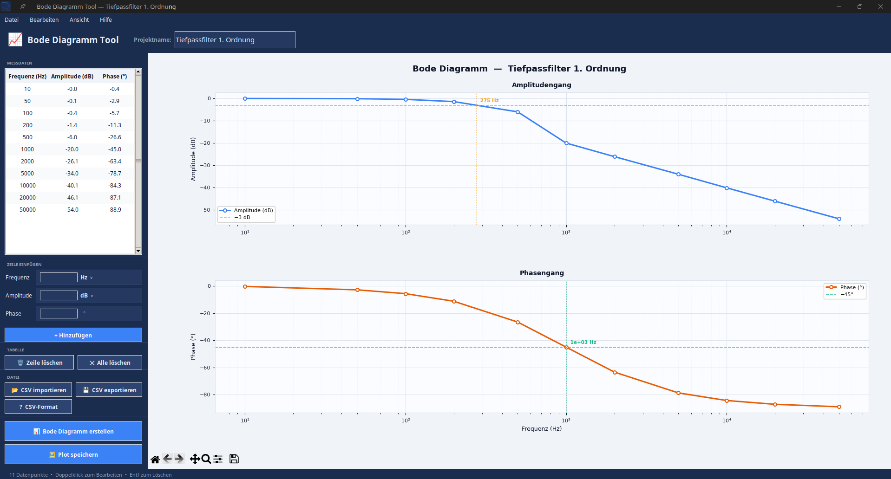

# 📈 Bode Diagramm Tool

Desktop-Anwendung zur Visualisierung von Frequenzgängen aus gemessenen Übertragungsverhalten.

---

## Screenshots



---

## Features

- Manuelle Dateneingabe (Frequenz, Amplitude, Phase) mit Einheitenauswahl
- **Einheiten:** Frequenz in Hz / kHz / MHz / GHz, Amplitude in dB / V / mV / µV / kV
- CSV-Import mit automatischer Erkennung von Trennzeichen und Dezimalzeichen
- Bode-Diagramm mit Amplituden- und Phasengang auf logarithmischer Achse
- Automatische −3 dB / −45°-Markierungen mit Grenzfrequenz-Interpolation
- Inline-Bearbeitung: Doppelklick auf Tabellenzellen
- Plot-Export als PNG, PDF oder SVG

## Download

Fertige Binaries ohne Installation — einfach herunterladen und starten:

👉 **[Releases](https://github.com/FelixLenz-Code/bode-diagramm-tool/releases/latest)**

| Datei | System |
|---|---|
| `BodeDiagrammTool-x86_64.AppImage` | Linux (x86\_64) |
| `BodeDiagrammTool.exe` | Windows 10 / 11 (64-bit) |
| `BodeDiagrammTool-macOS.dmg` | macOS (Intel · Apple Silicon via Rosetta 2) |

**Linux:**
```bash
chmod +x BodeDiagrammTool-x86_64.AppImage
./BodeDiagrammTool-x86_64.AppImage
```

**Windows:** `BodeDiagrammTool.exe` direkt ausführen — keine Installation nötig.

**macOS:** DMG öffnen, `.app` in den Programme-Ordner ziehen und starten. Da die App nicht von Apple signiert ist, erscheint beim ersten Start ein Sicherheitshinweis — in *Systemeinstellungen → Datenschutz & Sicherheit* auf „Trotzdem öffnen" klicken oder einmalig im Terminal ausführen:
```bash
xattr -cr /Applications/BodeDiagrammTool.app
```

## Aus dem Quellcode starten

### Voraussetzungen

```
Python >= 3.10
pip install matplotlib numpy
```

Unter Linux ggf. zusätzlich:

```
sudo apt install python3-tk
```

### Starten

```bash
python bode_tool.py
```

Oder per mitgeliefertem Startskript:

```bash
bash "Bode Tool starten.sh"
```

## CSV-Format

```
# Deutsch  (Semikolon, Komma als Dezimalzeichen)
Frequenz (Hz);Amplitude (dB);Phase (°)
100;-3,01;-45,0

# Englisch  (Komma, Punkt als Dezimalzeichen)
Frequency (Hz),Amplitude (dB),Phase (deg)
100,-3.01,-45.0
```

Zeilen mit `#` werden ignoriert. `# Projekt: Name` wird als Projektname übernommen.

## Tastenkürzel

| Kürzel | Aktion |
|--------|--------|
| `F5` | Diagramm erstellen |
| `F1` | CSV-Format Hilfe |
| `Strg+O` | CSV importieren |
| `Strg+S` | CSV exportieren |
| `Strg+N` | Neues Projekt |
| `Entf` | Zeile löschen |

## Lizenz

[CC BY-NC 4.0](LICENSE) — Namensnennung erforderlich, keine kommerzielle Nutzung.

---

## Hinweis zur KI-Unterstützung

Diese Software wurde vollständig mithilfe von Claude (einem KI-Assistenten von Anthropic) entwickelt. Der Autor hat die Anforderungen definiert, Entscheidungen getroffen und das Ergebnis geprüft — der Code selbst wurde durch den Dialog mit der KI generiert.

Das AeroScore-Logo wurde mit Google Gemini erstellt.

**Haftungsausschluss:** Die Software wird so bereitgestellt, wie sie ist (as-is), ohne jegliche Garantie auf Korrektheit, Vollständigkeit oder Eignung für einen bestimmten Zweck. Der Autor übernimmt keinerlei Haftung für Schäden, Datenverluste oder sonstige Probleme, die durch die Verwendung dieser Software entstehen. Die Nutzung erfolgt auf eigene Verantwortung.
