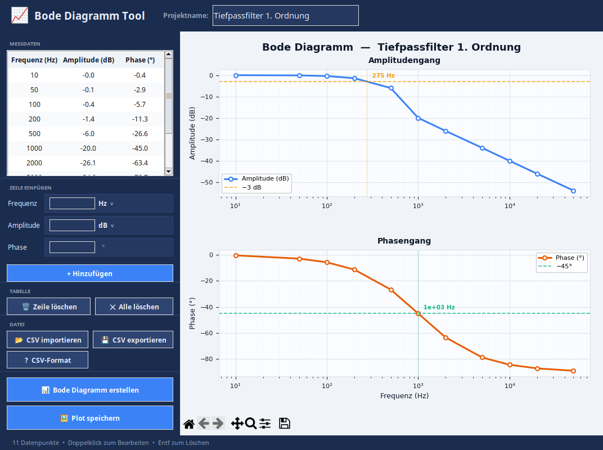
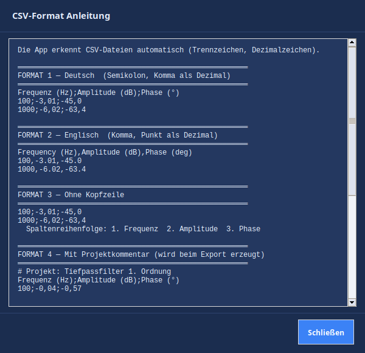

# 📈 Bode Diagramm Tool

Desktop-Anwendung zur Visualisierung von Frequenzgängen aus gemessenen Übertragungsverhalten.

---

## Screenshots



<details>
<summary>CSV-Format Anleitung</summary>



</details>

---

## Features

- Manuelle Dateneingabe (Frequenz, Amplitude, Phase) mit Einheitenauswahl
- **Einheiten:** Frequenz in Hz / kHz / MHz / GHz, Amplitude in dB / V / mV / µV / kV
- CSV-Import mit automatischer Erkennung von Trennzeichen und Dezimalzeichen
- Bode-Diagramm mit Amplituden- und Phasengang auf logarithmischer Achse
- Automatische −3 dB / −45°-Markierungen mit Grenzfrequenz-Interpolation
- Inline-Bearbeitung: Doppelklick auf Tabellenzellen
- Plot-Export als PNG, PDF oder SVG

## Voraussetzungen

```
Python >= 3.10
pip install matplotlib numpy
```

Unter Linux ggf. zusätzlich:

```
sudo apt install python3-tk
```

## Starten

```bash
python bode_tool.py
```

Unter Linux steht alternativ das mitgelieferte Startskript bereit:

```bash
bash "Bode Tool starten.sh"
```

## CSV-Format

```
# Deutsch  (Semikolon, Komma als Dezimalzeichen)
Frequenz (Hz);Amplitude (dB);Phase (°)
100;-3,01;-45,0

# Englisch  (Komma, Punkt als Dezimalzeichen)
Frequency (Hz),Amplitude (dB),Phase (deg)
100,-3.01,-45.0
```

Zeilen mit `#` werden ignoriert. `# Projekt: Name` wird als Projektname übernommen.

## Tastenkürzel

| Kürzel | Aktion |
|--------|--------|
| `F5` | Diagramm erstellen |
| `F1` | CSV-Format Hilfe |
| `Strg+O` | CSV importieren |
| `Strg+S` | CSV exportieren |
| `Strg+N` | Neues Projekt |
| `Entf` | Zeile löschen |

## Lizenz

[CC BY-NC 4.0](LICENSE) — Namensnennung erforderlich, keine kommerzielle Nutzung.
